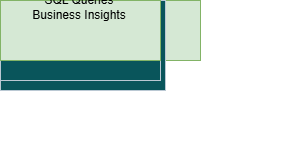

# Cloud Data Warehouse Analytics Project

## Overview

This project simulates a cloud cost analytics warehouse using PostgreSQL.

## Tech Stack

- PostgreSQL

- SQL

- Data Warehouse Modeling

- Star Schema

## Project Architecture

This project simulates a **cloud usage analytics data warehouse** built using PostgreSQL.  
Raw cloud usage logs are ingested, transformed into a **star schema warehouse**, and queried for analytics insights.

### Architecture Flow

AWS Usage Logs → Staging Layer → Data Warehouse (Star Schema) → Analytics Layer

## Architecture

Staging Layer → Data Warehouse → Analytics Layer

## Tables

Fact Table

- fact_cloud_usage

Dimension Tables

- dim_account

- dim_service

- dim_region

- dim_time

## Example Analytics Questions

- Which cloud services generate the highest cost?

- Which region consumes the most resources?

- How does cloud spending change monthly?

## Future Improvements

- Add Power BI dashboard

- Automate ETL pipeline

- Deploy warehouse on AWS

## Data Warehouse Architecture

### Data Pipeline Layers

**1. Data Ingestion Layer**
- Raw AWS usage logs are collected from cloud billing exports.

**2. Staging Layer**
- Data is loaded into a staging table:
  - `staging.aws_usage_logs`
- This layer stores raw records before transformation.

**3. Data Warehouse Layer**
- Data is transformed into a **Star Schema** model.

Fact Table:
- `fact_cloud_usage`

Dimension Tables:
- `dim_account`
- `dim_service`
- `dim_region`
- `dim_time`

**4. Analytics Layer**
- Business queries analyze cloud usage trends and cost insights.

## Data Model

The warehouse uses a **Star Schema design**.

### Fact Table

`fact_cloud_usage`

| Column | Description |
|------|-------------|
| account_id | Cloud account identifier |
| service_id | Cloud service used |
| region_id | Cloud region |
| usage_hours | Compute usage |
| cost | Cost incurred |
| usage_date | Date of usage |

### Dimension Tables

`dim_account` – Account details  
`dim_service` – Cloud service information  
`dim_region` – Cloud region data  
`dim_time` – Date and time attributes
